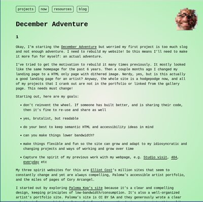

## Dec 1

Okay, I'm starting the [December Adventure](https://eli.li/december-adventure) but worried my first project is too much slog and not enough adventure. I need to rebuild my website! So this means I'll need to make it more fun for myself: an actual adventure.

I've tried to get the motivation to rebuild it many times previously. It mostly looked like the same homepage for the past 6 years. Then a couple months ago I changed my landing page to a HTML only page with dithered image. Nerdy, yes, but is this actually a good landing page for an artist? Anyway, the whole site is a hodgepodge now, and all of my projects that I crank out are not in the portfolio or linked from the gallery page. This needs must change!

Starting out, here are my goals:

* don't reinvent the wheel. If someone has built better, and is sharing their code, then it's fine to re-use and share as well
* yes, brutalist, but readable
* do your best to keep semantic HTML and accessibility ideas in mind
* can you make things lower bandwidth?
* make things flexible and fun so the site can grow and adapt to my idiosyncratic and changing projects and ways of working and grow over time
* Capture the spirit of my previous work with my webpage, e.g. [Studio visit](https://leetusman.com/studio-visit/), [404](https://leetusman.com/404), [everyday](https://leetusman.com/everyday) etc

My three spirit websites for this are [Elliot Cost](https://elliott.computer/)'s million sites that seem to constantly change and yet are always compelling, Paloma's accessible artist portfolio, and the miles of pages of Cory Arcangel. 

I started out by exploring [Paloma Kop's site](https://palomakop.tv/) because it's a clear and compelling design, keeping principles of low-bandwidth/consumption. It's also a well-organized artist's portfolio site. Paloma's site is CC BY SA and they generously wrote a clear [website info page](https://palomakop.tv/website-info/) which has lots of information on the design, going into things like lazy-loading images, minimizing js, using system fonts. Seems like a great way to get started. In fact, it's how I'm getting this site started!

One problem I have is that I crank out a ton of projects. I have hundreds. You wouldn't know that from the current website portfolio page, and some are tiny projects and others are big. So I've also studied [Cory Arcangel's site](https://coryarcangel.com/), who is the Merzbow of joke gallery objects. His site is designed to just list all of his art things, from websites to bots to saleable objects to each individual slightly different color shade sculpture. Certainly it's a minimal site design in some ways, but he uses Jekyll, which I have many years of experience working with now, and I'm not keen to build my own portfolio with it. To be honest, this is Cory's worst incarnation of his website. It's no longer fun to browse and his art has grown less interesting for me lately, but I'll just keep that to myself. 

I also looked at [Increpare's site](https://increpare.com/) since he cranks out dozens or hundreds of games too, to glean how that could look. The design is not fancy but it's fast and quickly shows what each game looks like and their info pages are straightforward, though maybe under-informing. 

I also looked at some friends' sites too that use long lists of projects that link to individual project pages. Not the right approach for me. I determined that it is important to me to have at least one image for each project that links to the project page. In contrast, there are some websites that are text only lists that link to project pages, but that's not a fun way (for me) to browse when designing work meant to be seen.

I spent time perusing cargo.site since they have nice brutalist templates, but when I actually try those sitesI find many harder to navigate through or not nearly as expansive as my site needs to be to capture all my work.

Okay, so I've tried some things, looked at code, ran some code. I am not linking it here but I pretty quickly 1-for-1 re-built my a clone of Arcangel's site in about 20 minutes. This is only because I've a lot of experience with Jekyll and his CSS is dead simple.

So if I'm not a fan of the Jekyll static site generator but also find HTML tedious when I have hundreds of pages then one other aspect of this is to build my own static site generator. I generally prefer using pandoc for converting between formats, so I'll create a wrapper around that.

And that's what I've done here: I built this very December Adventure page tonight starting with HTML and CSS from Paloma (thanks!) and then modifying, and using pandoc with a structured system.  

Here's the foundation of the static site builder, which runs after save:

```sh
#build.sh
pandoc -s index.md -o index.html -H assets/includes/header.html -c assets/css/main.css --metadata title="December Adventure"
```

The result of all that is this page you're looking at now.

Tomorrow: gallery view page experiments

## Dec 2

End of day 1 looked like this:



Images are converted and compressed with imagemagick:

```sh
convert source.png -resize 400x -quality 85% output.jpg
```

My partner has more experience as a professional web dev, looked at my day 1 writeup and was basically like "yeah i'm not reading that" but then gave me some good design and css feedback.

I took that into account, then showed them an old experiment page I did with an overlay. She suggested I try it using css background with a container. Because I'm trying to use out of the box semantic web classless CSS I got into a roadblock where I wanted the speckled digital dirt as an overlay for the whole page whilst also having the gradient background. At first this appeared impossible, with whichever is latter replacing the earlier one (due to 'cascading') but after some searching I came across a solution to place them in the same css line and it worked. Then I added some background blur to the body to try to make the text more readable, and played around a bit to balance trying to soften the hard edge of the bounding body box versus readability. I'll try to get some feedback later on whether this is as compelling design, and to test the readability/accessibility.

Here's the current page design:


## Dec 3

Beginning of day 3, here is the site currently. I didn't quite get to the gallery pages yet, but will try today.


I tracked down some tricky bugs today and no one but me will know but I'm writing it out anyway: basically, although my body background image speckles were blurred below the centered body section with text on desktop cross-browser, I found that the background wasn't blurred on iOS Firefox or Safari browsers that I tested. I couldn't quite find the answer online, but I noticed that the backdrop-filter css selector was relatively new and re-read the caniuse.com page for it several times. There's no firefox iOS column there and I remembered that firefox on iOS is actually webkit. iOS Safari requires a trick to figure out its version - it's based on what iOS system software you're running, and since mine is a version or two behind, it turns out my version of safari/webkit needs the --webkit prefix I believe. Also, I saw that images seemed to be loading on top of the speckled background image, but text wasn't, so as another potential fix I added a clear background by adding a background-color of rgba(255,255,255,0.1). In other words, white with a mostly transparent background. After deploying, one or both of these fixes seems to have fixed it! Tested on iOS on ipad and iphone now. All is well.

I also did some [accessibility checking](https://www.accessibilitychecke.org) to make sure the overlaid but blurred body speckles don't make it hard to read the text. It seemed to pass the test except for my codeblocks. When I look at the markdown->html rendered output, they seem to have added classes and spans. I'll come back to examine those again later and see why that's happening. It may be in the pandoc converter.

Okay, so now that I'm happy with this text page, I finally turned to working on the project gallery page. 

I again began by looking at Paloma's gallery page. In particular, I think the choice to use CSS is a smart one. I began by modifying and removing classes to try to get this closer to a classless CSS. I'm doing this to try to simplify. I also played with widths, margins, colors, removing borders, and sizing. I think it was a nice foundation  and I will ultimately likely make a number of changes here. Nothing to show yet, the work continues...

I also thought I'd do an experiment to see if my text page would work as the homepage/landing page.

I added just a few lines of css to override a few defaults trying to give a bit more oomph.

```css
/* assets/css/home.css */
body {
  width: 100%; 
  font-size: 36px;
  backdrop-filter:blur(3px);
}
```


To be honest, I don't think it feels like it 'works.'  While I like having a quick bio/statement up front, I think this isn't a strong landing page and will need to go back and look at some good landing page examples from other artists.

## Dec 4

I didn't have as much time to work on this today since I was helping my partner prep for a job interview earlier today and then had to go to school to teach my Monday night Programming for Visual Artists class. It was the final session before final projects and presentations are due. I helped a number of students, brought pizza for everyone, but I continued to work with students after the normal session ended and so I missed my bus and train. I live really far from school and the school shuttle and the train are not timed correctly anymore and so this meant I had to wait 45 minutes for the Metro North train. All this waiting meant I got home at midnight instead of 10:30pm, sheesh. This happens, it's okay. I had a good magazine to read and my computer. Next semester I'm teaching a more normal schedule. As part of students' final projects they need to do writing, screenshots, and talk about their project development, very much like how folks are writing about their ongoing work for DecemberAdventure, so I pointed out a few of the logs and had students check them out.

On the train home I worked on the gallery page a bit, and did a little bit more before bed. I think it's coming along, but still more work to be done.

*Page last updated: 2023-12-04*

## Dec 5

Was busy on other projects today that didn't involve code. 
